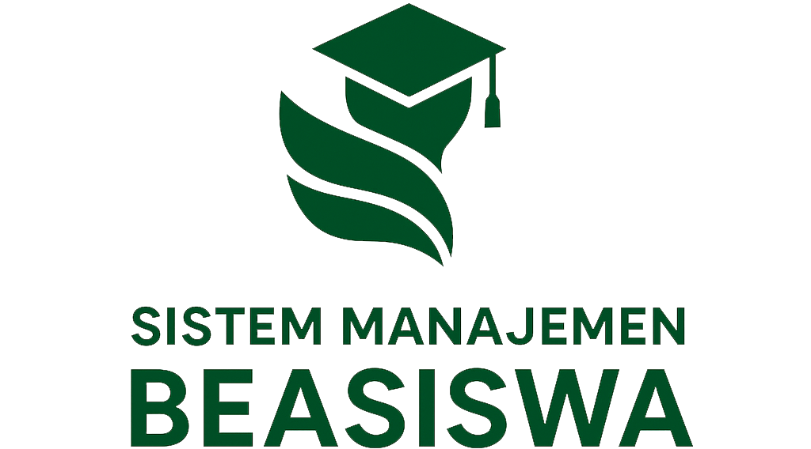

# APP Beasiswa



APP Beasiswa adalah aplikasi manajemen beasiswa yang dirancang untuk mempermudah proses pengelolaan program beasiswa secara digital, mulai dari pendaftaran, seleksi, verifikasi berkas, hingga pengumuman penerima beasiswa. Sistem ini membantu meningkatkan transparansi, efisiensi, dan akuntabilitas dalam pengelolaan beasiswa.

## ✨ Fitur Utama

- **Dashboard Interaktif**: Menampilkan statistik pendaftar berdasarkan periode.
- **Pendaftaran Beasiswa Online**: Mahasiswa dapat mengajukan beasiswa secara mandiri melalui portal yang terintegrasi.
- **Manajemen Data Mahasiswa**: Pengelolaan data mahasiswa, program studi, fakultas, dan informasi akademik.
- **Verifikasi Berkas**: Proses pemeriksaan dokumen persyaratan secara digital dengan status validasi.
- **Seleksi & Penilaian**: Mendukung proses seleksi berdasarkan kriteria dan bobot penilaian yang telah ditentukan.
- **Manajemen Jenis Beasiswa**: Mendukung berbagai jenis beasiswa seperti KIP, Prestasi, Tahfidz, Bidik Misi, maupun beasiswa internal kampus.
- **Pengumuman Hasil Seleksi**: Publikasi hasil seleksi yang dapat diakses secara online oleh mahasiswa.
- **Manajemen Periode Beasiswa**: Pengaturan periode pendaftaran, seleksi, hingga penetapan penerima.
- **Role & Permission**: Hak akses terpisah untuk Administrator, Operator, Reviewer, dan Mahasiswa.
- **Laporan & Rekapitulasi**: Export laporan penerima beasiswa dalam format PDF maupun Excel.

## 🚀 Teknologi yang Digunakan

- **Backend**: Laravel 12.x
- **Frontend**: Bootstrap CSS
- **Database**: MySQL / MariaDB
- **Authentication**: Laravel Authentication
- **Export Data**: Laravel Excel
- **Icons**: Font Awesome

## 🛠️ Panduan Instalasi Lokal

1. **Clone Repository**
   ```bash
   git clone https://github.com/username/app-beasiswa.git (HTTPS)
   git clone git@github.com:username/app-beasiswa.git (SSH)
   cd app-beasiswa
   ```

2. **Instal Dependensi**
   ```bash
   composer install
   ```

3. **Konfigurasi Lingkungan**
   Salin file `.env.example` menjadi `.env`, kemudian sesuaikan konfigurasi database.
   ```bash
   cp .env.example .env
   php artisan key:generate
   ```

4. **Migrasi Database**
   ```bash
   php artisan migrate
   ```

5. **Seeder Data (Opsional)**
   ```bash
   php artisan db:seed
   ```

6. **Jalankan Aplikasi**
   ```bash
   php artisan serve
   ```

## 📖 Panduan Administrator

Masuk ke halaman administrator melalui `/login/secret`.

Beberapa menu utama yang tersedia:

- **Dashboard**: Melihat statistik dan ringkasan data beasiswa.
- **Data Master**: Mengelola data tahun kegiatan, jenis beasiswa, jadwal kegiatan, form data, dan pengguna.
- **Surveyor**: Melihat dan mengelola surveyor.
- **Seleksi Administrasi**: Memantau seluruh pengajuan beasiswa mahasiswa.
- **Seleksi TPA**: Memantau dan menentukan kelulusan TPA berdasarkan hasil penilaian.
- **Seleksi Akhir**: Memantau dan menentukan kelulusan akhir berdasarkan hasil survei/penilaian.
- **Rekapitulasi**: Laporan rekapitulasi pendaftar maupun penerima beasiswa.

## 📖 Panduan Pengguna (Pendaftar/Verifikator/Surveyor)

Masuk ke halaman dashboard dengan cara login satu pintu melalui platform SATe.

## 🔒 Keamanan

- Autentikasi pengguna menggunakan Laravel Authentication.
- Middleware Role & Permission untuk membatasi hak akses.
- Validasi data pada setiap proses input.
- Proteksi CSRF dan XSS bawaan Laravel.
- Password tersimpan menggunakan hashing BCrypt.

## 📊 Tujuan Pengembangan

Aplikasi ini dikembangkan untuk:

- Mempermudah proses administrasi beasiswa.
- Mengurangi penggunaan dokumen fisik.
- Mempercepat proses verifikasi dan seleksi.
- Meningkatkan transparansi dalam penetapan penerima beasiswa.
- Menyediakan laporan yang akurat dan mudah diakses.

---

© 2026 APP Beasiswa. Dikembangkan untuk mendukung digitalisasi layanan pengelolaan beasiswa secara efektif, transparan, dan akuntabel.